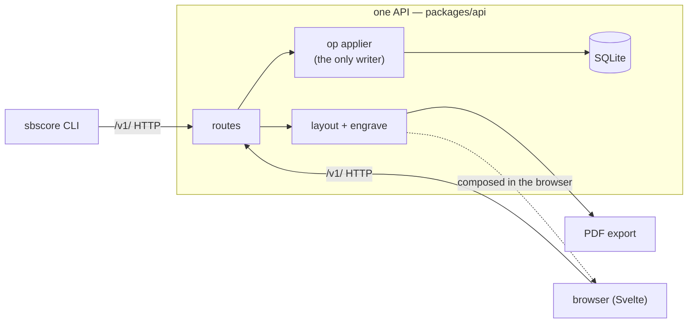

# sibei-score

A local-only jazz lead sheet notation app: a single staff with chord symbols above it, four bars
to a line, the way a Real Book prints it — authored and edited **equally from a browser and a
command line**, and exported as a print-ready PDF.

> **Status: v0.1 is complete**, and local-only by design (ADR-0001). Built and landed (V1–V8): the
> score model, layout engine, our own engraver, PDF **and MusicXML** export, the store, the `/v1/`
> API, the CLI, and an editing browser with live updates; jazz **chords**, enharmonic **spelling**
> and **transposition**, instrument **parts**, **structure** (sections, rehearsal letters, repeat and
> ending barlines), **undo/redo**, a **library** with duplicate and delete, and a **container** you
> can bring up with `make up`. Photo (OMR) import is v0.2 — see [`SLICES.md`](SLICES.md); the hosted,
> multi-user direction is sketched in [`docs/hosting.md`](docs/hosting.md).

<p align="center">
  
  <br>
  <em>The score view — the rail carries what the engraving can't say (review state, the face and paper, export), and the sheet renders through the same layout + engrave the PDF does.</em>
</p>

## Why

Jazz lead sheets have a specific look, and general-purpose engravers don't quite land it. So
sibei-score owns its engraver (two faces: Bravura for engraved, Petaluma for the handwritten Real
Book look), and it treats **agent-friendliness as a first-class constraint**: every edit is an
operation with both a CLI verb and a browser control, addressable as `bar12.beat3`, and a chart
projects to a compact text form an agent can read cheaply. The browser and the CLI are two clients
of one API, so they cannot disagree about a chart.



## Quick start

Requires only [Docker](https://docs.docker.com/get-docker/) and `make`. Everything runs on your own
machine (see [Offline by design](#offline-by-design) below). One command:

```sh
make up                    # builds the image and runs the app (Ctrl-C stops it)
```

Open **<http://127.0.0.1:8080>** — the browser UI and the `/v1/` API on one origin, published to
**loopback only** so nothing on your LAN can reach it (ADR-0029). Charts and cached exports live in a
named volume and survive restarts. Run **`make`** on its own to list every command. (The first `make up`
also builds the OMR import worker, so it takes a few minutes; later runs are instant.)

The library starts empty, so seed a chart to look at — in a second terminal, once `make up` is running:

```sh
make sample                # creates a "Body and Soul" demo chart in the running app
```

Reload the browser, open the chart, click a note, and change its pitch: the store updates and every
open tab reflects it live. Export a PDF or MusicXML from the score view's **Export** rail. You can also
drive the CLI without installing anything — it runs inside the container:

```sh
make cli ARGS="list"                    # list charts
make cli ARGS="show soul"               # the text projection: a four-bar grid with addresses
make cli ARGS='new --title "Blue Monk" --composer "Thelonious Monk" --key Bb --bars 12'
```

> **No port juggling (optional).** Running several projects locally? Copy `compose.override.yaml.example`
> to `compose.override.yaml` (gitignored) and `make up` publishes **no host port at all** — a
> machine-wide [Traefik](https://traefik.io) proxy auto-detects the container and serves it at
> **<http://sibei-score.localhost/>** instead, so nothing can ever collide on 8080. The `.example` file
> has the one-time proxy setup. This routes through a proxy that listens beyond loopback, so it stays a
> personal, gitignored convenience; the committed default remains loopback-only on 8080.

Prefer to run from source (Node ≥ 22 + [pnpm](https://pnpm.io)) for development? `make check` runs the
full test gate and `make` lists the source-based targets; see [`AGENTS.md`](AGENTS.md) for the layout.

The full command surface is in **[`docs/cli.md`](docs/cli.md)**, and `pnpm sbscore --help` prints the
live list of verbs, address forms and exit codes.

## Usage

Everything is an **operation** through the `/v1/` API, addressed three ways (ADR-0007):

```
bar12.beat3    a beat within a bar (1-based, fractional: bar12.beat2.5; bar0 is the pickup)
bar12.n3       the third item in bar 12
note-17        a stable id
```

A beat with nothing on it is an *error* that lists the bar's real onsets, never a snap to the
nearest note — the error is the feature. See **[`docs/cli.md`](docs/cli.md)** for the full reference;
`sbscore --help` prints the live list of verbs, the address forms, and the exit codes (which are a
contract). The two live surfaces:

- **CLI** — charts (`new`, `list`, `open`, `show`, `duplicate`, `rm`, `meta set`), notes and rests
  (`note add|set|rm`, `rest add|rm`), chords (`chord set|rm`), `transpose`, structure
  (`section`, `barline`, `repeat`, `ending`), `undo`/`redo`, `batch`, and `export` (PDF or
  `--musicxml`, with `--for` an instrument part). `--json` on every verb for machine-readable output.
- **Browser** — a library view with search, duplicate and delete, and a score view that renders
  through the *same* layout and engrave packages the PDF does. It edits notes, rests and chords,
  transposes, sets structure from a bar's panel, exports (a PDF | MusicXML toggle), undoes with
  ctrl-Z, and repaints live when the chart changes elsewhere.

## Offline by design

sibei-score makes **no network connection at runtime** — not for fonts (they are vendored), not for
rendering, not for export, and there is no telemetry and no account. Everything is your own machine
talking to a server on your own machine. The container publishes its port to `127.0.0.1` only, so
the app is never reachable from your LAN (ADR-0029). MusicXML and PDF are produced locally and are
yours to keep. (Building from source and building the image do use the network to fetch
dependencies; *running* the app does not.)

## Screenshots

A few more states below; the full set — including the handwritten face and a 5/4 chart — is in
[`screenshots/`](screenshots/), regenerable with `pnpm screenshots`.

| The library | Editing a note |
|---|---|
| [](screenshots/library.png) | [](screenshots/inspector.png) |
| Search by title, composer or key. New charts come from the CLI. | Click a note; edit pitch, duration and accidental. Every edit is an op through the same API the CLI uses. |

The handwritten **jazz** face (Petaluma) is one control away from the engraved default:

<p align="center">
  
</p>

## Repository

This is a pnpm workspace. The map, the exact commands, and the invariants an agent (or a
contributor) must not break live in **[`AGENTS.md`](AGENTS.md)** (loaded automatically by
Claude Code via `CLAUDE.md`), with depth under [`agent_docs/`](agent_docs/). The project was fully
planned before any code; those decisions of record are the planning corpus:

| File | What it is |
|---|---|
| [`PLAN.md`](PLAN.md) | Scope, requirements R0–R9, mechanisms, testing approach, assumed defaults |
| [`SLICES.md`](SLICES.md) | The 14 build slices in order, each with its own test plan |
| [`CONTEXT.md`](CONTEXT.md) | Glossary and the decision register — these terms are used exactly |
| [`docs/adr/`](docs/adr/) | The ADRs, the decisions themselves |
| [`QUESTIONS.md`](QUESTIONS.md) | The question-and-answer audit trail behind them |

## License

MIT — see [`LICENSE`](LICENSE).
