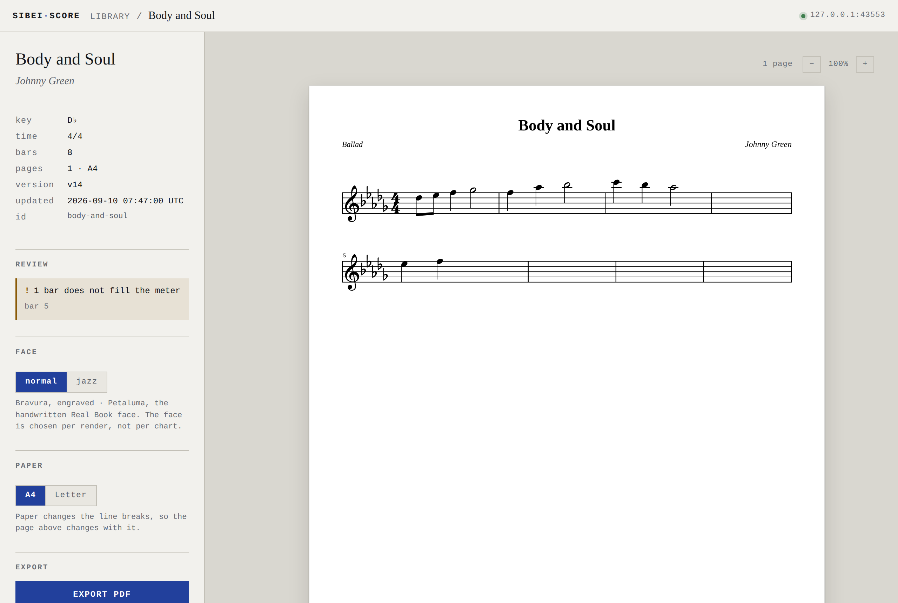
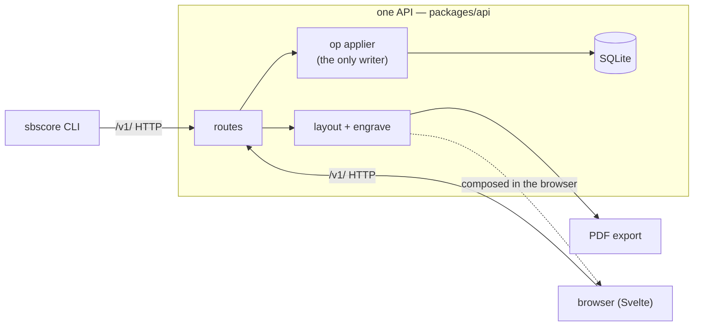
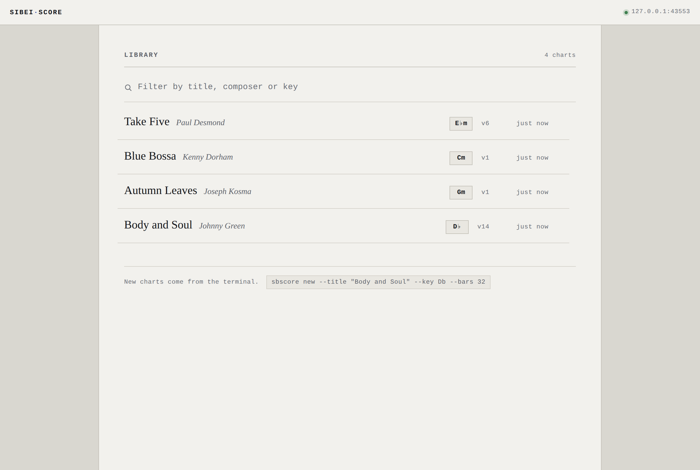
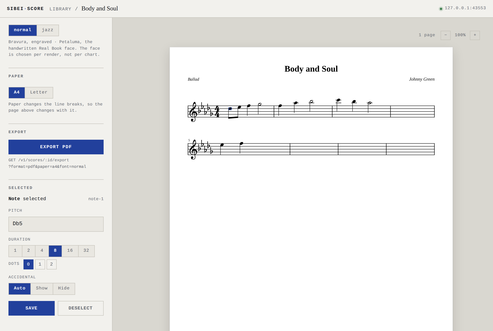
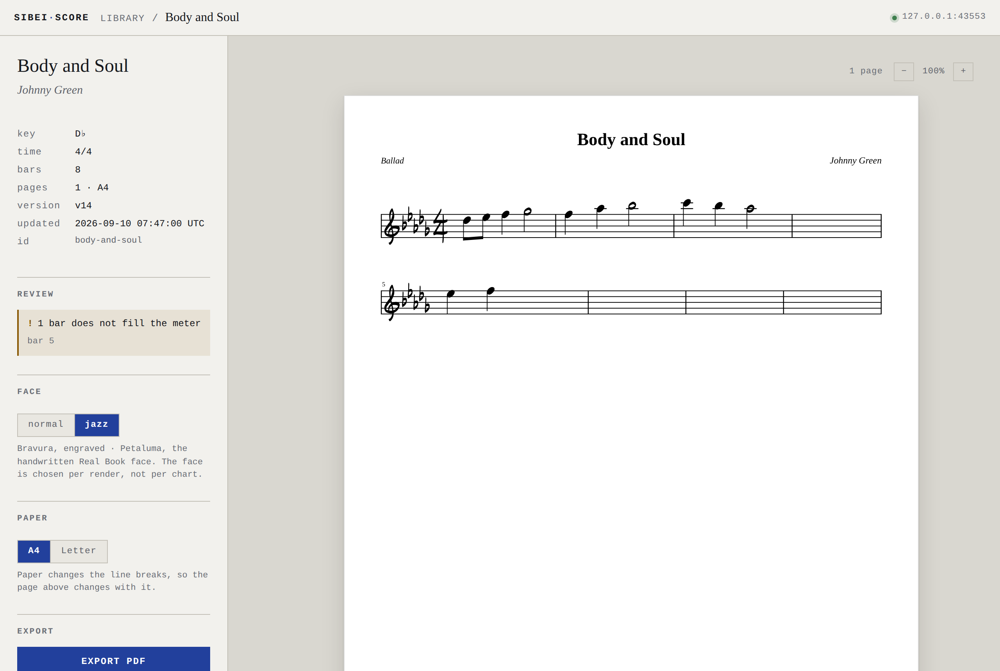

# sibei-score

A local-only jazz lead sheet notation app: a single staff with chord symbols above it, four bars
to a line, the way a Real Book prints it — authored and edited **equally from a browser and a
command line**, and exported as a print-ready PDF.

> **Status:** in development, local-only by design (ADR-0001). The score model, layout engine,
> engraver, PDF export, store, `/v1/` API, CLI, and an editing browser with live updates are all
> built (V1–V4). Chords, transposition, and photo import are planned — see [`SLICES.md`](SLICES.md).

<p align="center">
  
  <br>
  <em>The score view — the rail carries what the engraving can't say (review state, the face and paper, export), and the sheet renders through the same layout + engrave the PDF does.</em>
</p>

## Why

Jazz lead sheets have a specific look, and general-purpose engravers don't quite land it. So
sibei-score owns its engraver (two faces: Bravura for engraved, Petaluma for the handwritten Real
Book look), and it treats **agent-friendliness as a first-class constraint**: every edit is an
operation with both a CLI verb and a browser control, addressable as `bar12.beat3`, and a chart
projects to a compact text form an agent can read cheaply. The browser and the CLI are two clients
of one API, so they cannot disagree about a chart.



## Quick start

Requires Node ≥ 22 and [pnpm](https://pnpm.io).

```sh
pnpm install
pnpm serve                 # starts the local API on 127.0.0.1:4321 (leave it running)
```

Then, in another terminal, author a chart entirely from the CLI:

```sh
pnpm sbscore new --id soul --title "Body and Soul" --composer "Johnny Green" --key Db --bars 8
pnpm sbscore note add soul bar1.beat1 --pitch Db5 --dur 8
pnpm sbscore note add soul bar1.beat2 --pitch F5  --dur 4
pnpm sbscore show soul                       # the text projection: a four-bar grid with addresses
pnpm sbscore export soul -o .                # writes ./Body and Soul.pdf
```

Or open it in the browser and edit it there:

```sh
pnpm ui                    # Vite dev server on 127.0.0.1:5173 (proxies /v1 to the API)
# visit http://127.0.0.1:5173/#/score/soul, click a note, change its pitch — the store updates,
# and any other open tab (or `sbscore show`) reflects it without a reload.
```

## Usage

Everything is an **operation** through the `/v1/` API, addressed three ways (ADR-0007):

```
bar12.beat3    a beat within a bar (1-based, fractional: bar12.beat2.5; bar0 is the pickup)
bar12.n3       the third item in bar 12
note-17        a stable id
```

A beat with nothing on it is an *error* that lists the bar's real onsets, never a snap to the
nearest note — the error is the feature. `sbscore --help` lists every verb, the address forms, and
the exit codes (which are a contract). The two live surfaces:

- **CLI** — `sbscore new | show | open | export | note add|set|rm | rest add|rm | meta set | list | rm`.
  `--json` on every verb for machine-readable output.
- **Browser** — a library view with search and a score view that renders through the *same* layout
  and engrave packages the PDF does, edits notes and rests, and repaints live when the chart changes
  elsewhere.

## Screenshots

A few more states below; the full set — including the handwritten face and a 5/4 chart — is in
[`screenshots/`](screenshots/), regenerable with `pnpm screenshots`.

| The library | Editing a note |
|---|---|
| [](screenshots/library.png) | [](screenshots/inspector.png) |
| Search by title, composer or key. New charts come from the CLI. | Click a note; edit pitch, duration and accidental. Every edit is an op through the same API the CLI uses. |

The handwritten **jazz** face (Petaluma) is one control away from the engraved default:

<p align="center">
  
</p>

## Repository

This is a pnpm workspace. The map, the exact commands, and the invariants an agent (or a
contributor) must not break live in **[`AGENTS.md`](AGENTS.md)** (loaded automatically by
Claude Code via `CLAUDE.md`), with depth under [`agent_docs/`](agent_docs/). The project was fully
planned before any code; those decisions of record are the planning corpus:

| File | What it is |
|---|---|
| [`PLAN.md`](PLAN.md) | Scope, requirements R0–R9, mechanisms, testing approach, assumed defaults |
| [`SLICES.md`](SLICES.md) | The 14 build slices in order, each with its own test plan |
| [`CONTEXT.md`](CONTEXT.md) | Glossary and the decision register — these terms are used exactly |
| [`docs/adr/`](docs/adr/) | The ADRs, the decisions themselves |
| [`QUESTIONS.md`](QUESTIONS.md) | The question-and-answer audit trail behind them |

## License

MIT — see [`LICENSE`](LICENSE).
