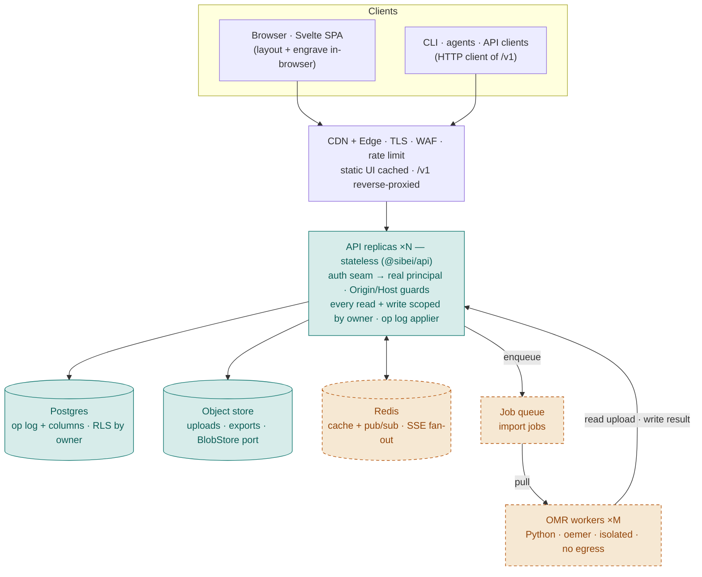
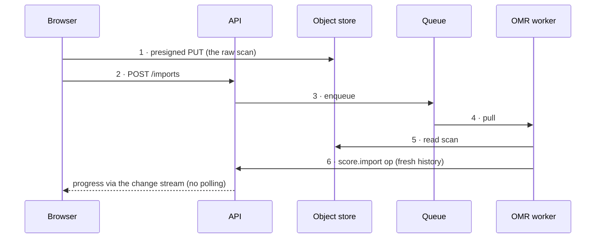

# Hosting sibei-score

A forward-looking plan for what the local, single-user app becomes when it is hosted for many users on
the internet. This is a **direction document, not a decision of record** — the decisions themselves are the
ADRs it cites (chiefly ADR-0001, which made hosting a goal from the first commit). Nothing here is built
yet beyond what the ADRs already required; treat it as the map for the transition, and correct it against
the code when the two disagree (per AGENTS.md).

## The one idea to hold onto

**Almost every box in a hosted deployment is an adapter swap behind a port the code already has. Only two
things are genuinely new: a cross-replica change bus, and a job queue with a worker pool.**

ADR-0001 paid a small tax up front — a repository interface, an auth seam, an `owner` on every row,
stateless request handling — precisely so that hosting would be *"a deployment change rather than a
rewrite."* This document cashes that in. The colour coding below (**swap** vs **new**) is the whole point.

## Target architecture

A conventional stateless-API SaaS: a static frontend on a CDN, TLS and rate-limiting at the edge, several
identical API replicas that hold no state of their own, and a data tier of Postgres + object storage + a
cache/message layer. Imports run off to the side as jobs.

**Teal (`swap`)** is a seam that already exists and needs only a production adapter. **Amber (`new`)** is a
net-new subsystem. Three things hold this together and are already true today:

- **Same origin.** The API serves the built UI (V8g) or a CDN fronts it — the Origin/Host guards hold
  either way.
- **Concurrency is already safe.** Optimistic concurrency (`expectedVersion` → `409`) already makes two
  writers on one chart safe, so multi-user is mostly for free.
- **No secrets in the wrong places.** Secrets come from a manager, never the store; structured logs carry
  no bytes and no paths (ADR-0029).

## Local → hosted, seam by seam

Each of ADR-0001's eight hosting constraints, and what it becomes. "Swap" = a new adapter behind an
existing interface; "New" = a genuinely new subsystem.

| Seam (built today) | Local realization | Hosted realization | Effort |
|---|---|---|---|
| **Auth seam** (`resolveLocalPrincipal`) | Every request resolves to owner `local` | Resolve a real principal from a session/OIDC token; `owner` = user (or org) id | Swap |
| **Owner on every row** (`Owner` field) | Always `'local'`, but present since day one | The tenancy key — every query filtered by it; no schema migration for tenancy | Swap |
| **Store repository** (`ScoreStore`) | SQLite adapter (`@sibei/api/sqlite`) | Postgres adapter behind the same interface; row-level security by owner | Swap |
| **Blob store** (`BlobStore`) | Directory on disk | S3-compatible object storage; presigned URLs so bytes never proxy through the API | Swap |
| **Stateless API** (no in-memory score cache) | One process, all state in the store | N replicas behind a load balancer; scale horizontally, no sticky sessions | Swap |
| **Boundary guards** (Origin/Host/no-CORS) | Loopback allow-list, same-origin UI | Allow-list the real domain(s); real CORS only if the API is a separate origin; add rate limits | Swap |
| **Change stream** (in-process bus → SSE) | One process fans out to its own subscribers | Publish to Redis; every replica's SSE relays it — fan-out across the fleet | **New** |
| **Import as a job** (ADR-0005 worker split) | V10: a durable `JobStore`, an in-process runner, and a Python worker container — one process, one worker | Queue (Redis/SQS) + Python worker pool; presigned upload in, `score.import` op out | Swap the queue + scale the pool |

## Uploads are jobs, not requests

The one flow that is not a simple CRUD round-trip is importing a scanned lead sheet through OMR. It is slow,
CPU-heavy, and runs untrusted bytes through `oemer` — so it belongs off the request path (ADR-0005). The
client uploads straight to object storage, the API only enqueues, a worker does the heavy lifting, and
progress rides back on the change stream the app already has.

Step 6 reuses the **same server-only `score.import` op that library _duplicate_ already uses** (ADR-0003,
ADR-0008), so an imported chart enters through the one write path with a fresh history. The worker runs
isolated — resource-capped, no network egress — because it processes untrusted files.

## Best practices, in priority order

Each notes where the seam already exists.

1. **Identity & tenancy.** Fill the auth seam with a real provider (hosted OIDC, not hand-rolled password
   storage). *Never trust a client-supplied owner* — the principal comes from the verified session. Scope
   every query by owner and back it with Postgres **row-level security**, so a missed `WHERE` cannot leak
   across tenants. *(seam exists)*
2. **Data & storage.** Postgres for the store (op log + extracted columns); object storage for uploads,
   exports and cached PDFs; serve blobs via **presigned URLs** rather than streaming through the API.
   Automated backups + point-in-time recovery (and the op log lets you replay history). **The copyright
   gate (ADR-0001):** uploads private and account-scoped, no shared library, no training corpus from user
   uploads. *(ports exist)*
3. **Statelessness & scale.** Keep replicas stateless — no in-memory score cache that assumes one server.
   Move the change bus to **Redis pub/sub** so an SSE client on replica A hears an edit made on replica B.
   Autoscale on CPU/connections; health checks already exist at `/v1/health`. *(already true)*
4. **Concurrency & realtime.** Keep **optimistic concurrency** (`expectedVersion` → `409`) — it already
   makes two writers on one chart safe. The op log gives audit, undo, and a clean multi-device sync story
   for free. WebSocket only if you need client→server pushes; SSE is enough for one-way repaint. *(already
   true)*
5. **Security at the edge.** TLS everywhere; the Origin/Host guards **widen** to the real domain, they do
   not loosen. Rate-limit and cap bodies (a cap already exists); **validate uploads by decoding** them, not
   by extension (ADR-0029). Secrets from a secret manager via env, never the store. Isolate the OMR worker:
   locked-down container, resource caps, no network egress. *(guards exist)*
6. **Delivery & operations.** Migrations are already **forward-only on read** (ADR-0028), so rolling deploys
   are safe. Add tracing + metrics to the structured logs that already exist; alert on `409` storms and
   worker backlog. Freeze `/v1` to **additive-only** at this transition (ADR-0022) so existing agents keep
   working.

## A sane order to do it in

Getting there without a big-bang rewrite:

- **Phase 0 — Finish v0.1, ship the container.** The single-container local app (the bind decision, then the
  Dockerfile). This is the deployable unit everything else scales out from, and it validates the
  same-origin, guarded, volume-backed shape end to end.
- **Phase 1 — Swap the adapters.** Postgres store adapter, object-storage blob adapter, real principal
  resolver in the auth seam. No new subsystems yet — still one replica, same behavior, production-grade data
  stores.
- **Phase 2 — Go multi-replica.** Redis-backed change bus, load balancer, N stateless replicas. The first
  genuinely new subsystem, and where "other users on the internet" becomes real.
- **Phase 3 — Add import (v0.2).** The queue + Python OMR worker pool, presigned uploads, progress on the
  change stream. The second new subsystem, and the one the OMR ADR series (0005, 0010, 0023) was written
  for.

## The honest risk register

The parts most likely to bite are **not** the adapter swaps — they are the two new subsystems and the
things a single-user tool never had to face: cross-replica realtime fan-out, abuse and cost control on
public uploads, OMR worker isolation and capacity, and the operational weight of running someone else's
data (backups, incident response, the copyright posture). Budget for those, not for the Postgres migration.

## The bind decision this rests on

The very first step, publishing the container's port, collides with ADR-0029's "bind `127.0.0.1`, never
`0.0.0.0`." The resolution — separate the **bind** address (inside the container) from the **publish**
address (what the host exposes) — is recorded as an amendment to ADR-0029 and realized by the container
slice: the process binds `0.0.0.0` inside the container via a config knob (default `127.0.0.1`), while
Compose publishes only to the host's loopback. LAN-unreachability moves to the publish line, where a
container can actually enforce it, and the guards stay on. This is Phase 0's one real design question and
it is the same `0.0.0.0` bind the hosted deployment uses behind its edge.

---

References: ADR-0001 (local-first, hosting-shaped), ADR-0005 (Node API / Python OMR worker), ADR-0006
(store & blob seams), ADR-0022 (API versioning & the hosted freeze), ADR-0029 (the local HTTP threat
model).
