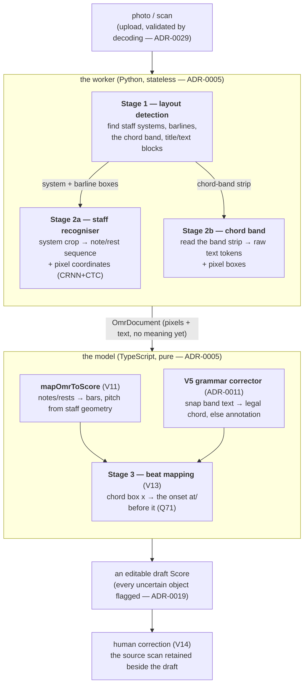

# The OMR pipeline (a map)

How a photo of a lead sheet becomes an editable `Score`. This is the **overview** — the one place the
staged plan is drawn end to end. It does not make decisions; it points at the ones already made. The
decisions of record are the ADRs (chiefly [ADR-0031](adr/0031-bespoke-recogniser.md), the bespoke
recogniser; [ADR-0010](adr/0010-hybrid-omr-pipeline-oemer.md), oemer; [ADR-0005](adr/0005-node-owns-api-python-omr-worker.md),
the Node/Python split), the build order is [`SLICES.md`](../SLICES.md) (V9–V17), and the scoring is
[`docs/eval.md`](eval.md). Where this doc and the code disagree, the code is right — fix this in the
same PR.

## The shape

Recognition is **staged, split by content** (ADR-0031). The domain is narrow — monophonic, single
staff, a chord band above — so each stage is a small, separately-trainable, CPU-sized model rather than
one big end-to-end network. Everything downstream of recognition depends only on the `OmrDocument`
contract ([`packages/model/src/omr.ts`](../packages/model/src/omr.ts)), re-validated at the language
boundary, so the whole recogniser is swappable by construction (ADR-0005).

## Stage by stage — what exists, what does not

| Stage | Does | Consumes → produces | State |
|---|---|---|---|
| **0 · Upload** | Validate the image by decoding it at the boundary; store it in the BlobStore; record a durable import **job** | bytes → a job + a retained scan | **done** (V10, ADR-0029/0018) |
| **1 · Layout detection** | Find staff systems, barlines, the chord band, title/text blocks. Bars & four-bar phrases are *derived* from barlines + system breaks, not detected | page → object boxes | **done (V16, bespoke engine).** A small centre-point detector (`engines/bespoke/layout.py`, `detect.onnx`) trained on synthetic page-box labels; staff recall ~0.92 on held-out synthetic, robust on real photos where the OpenCV finder invents a phantom title-staff. oemer and the `heuristic` engine still do their own geometric staff-finding |
| **2a · Staff recogniser** | One system crop → an ordered note/rest sequence with x-coordinates | crop → notes+rests (bbox, duration; pitch carried by the token) | **done (V15, bespoke engine).** A small CRNN+CTC trained on synthetic data; coordinates from the CTC column index. oemer does its own equivalent internally |
| **2b · Chord band** | Read the chord-band strip into raw text tokens with boxes | band strip → `bandTokens` | **done on oemer/heuristic via PaddleOCR (V13d, ADR-0027).** The **bespoke** chord recogniser is **trained (V17c)** — a character-level CRNN+CTC, held-out chord accuracy 0.968, `chord.onnx` checksum-pinned — but the bespoke engine still emits an empty band until **V17d** wires it in |
| **Map · `mapOmrToScore`** | Turn recognised objects into a `Score`: bars from barlines, notes end-to-end by x, pitch from staff geometry (treble) | `OmrDocument` → `Score` | **done (V11)** |
| **Grammar · corrector** | Snap band text to a legal chord (V5 grammar, ADR-0011), else keep as a flagged annotation (Q56) | token text → chord \| annotation | **done (V5/V13)**, injected into the mapper |
| **3 · Beat mapping** | Align each chord box's x to the note/rest onset at or before it | chord x + note onsets → chord onset | **done (V13)** |
| **Correction** | Human fixes the draft against the retained scan; flags/invalid-bar shading point at the doubts | draft → corrected chart | **done (V14)** |

### Proposed but not planned: a cross-bar / spanning stage

Notation that **spans** notes or bars is read by none of the per-crop stages above and is currently
left to the human (ADR-0019 accepts this — ties and triplets are exactly what OMR gets least
reliably). A future stage would run *after* Stage 1+2a on the assembled coordinates (it needs the note
x-positions) and detect ties, slurs, 8va/ottava lines and glissandi. Two constraints: some of these
need **engraver support first** (the engraver has no ottava at all today, so 8va cannot be rendered or
trained for), and each needs a Score-model field to land in. Tracked as planning: **KAN-1444**
(spanning notation), **KAN-1440** (tuplets/ties). See also the notation-coverage epic (alternate
noteheads KAN-1442, multi-voice KAN-1443).

## The engine seam

Stages 1+2a+2b are the *recogniser*, and there are three interchangeable ones behind
`engines/get_engine(name)` (`--engine` / `$SIBEI_OMR_ENGINE`), all emitting the same `OmrDocument`:

- **`oemer`** — the default (ADR-0010). A full-page dual-U-Net segmentation model that internally does
  the equivalent of stages 1+2a. Accurate-ish but ~7 GB RAM and ~13 min/page — the two costs ADR-0031
  exists to escape.
- **`heuristic`** — OpenCV only, no weights, low RAM (V13c). Dev/test scaffolding and the seed of the
  bespoke direction; also the source of the staff-finder the bespoke engine borrows until Stage 1
  exists.
- **`bespoke`** — the trained pipeline (ADR-0031). Stage 1 (V16, `detect.onnx`) + Stage 2a (V15c,
  `model.onnx`); the borrowed heuristic staff-finder is gone. Stage 2b (chords) is **trained (V17c,
  `chord.onnx`)** and wired into the engine in V17d. It earns the **default** only by beating oemer on
  the harness (accuracy *and* RAM), never by fiat — the V16 harness run, extended to chords in V17e.

## Data and training

The engraver run in reverse is a **ground-truth generator** (ADR-0031's key insight): `packages/synth`
renders plausible lead sheets and reads off both the detection boxes and the note/chord sequences for
free, with domain randomisation (font, skew, blur, JPEG, shadow, paper). This is what makes "train our
own OMR" tractable without a labelling slog. Models train on a **RunPod GPU** pod (`tools/runpod/rp`,
ADR-0032) and export to ONNX; inference is **CPU-first** (ADR-0025), and weights are **baked +
checksummed at build time** (ADR-0024). No stage ever calls out over the network at runtime.

The vocabulary for Stage 2a is **flat-semantic** — one CTC class per `(pitch × duration)` event, closed
and complete by construction from the generator's own ladder + duration menu (`packages/synth/src/vocab.ts`),
so decode is one lookup and a probe failure is a *data* failure, not a tokeniser one.

## The gate — three dimensions, not one

A bespoke stage earns its place only on the V12 harness (`docs/eval.md`), measured on all three axes
ADR-0031 makes first-class:

- **Accuracy** — noteF1 / chordF1, alignment-based (LCS/Levenshtein), scored against the generator's
  ground truth and a real-photo control set.
- **Speed** — sec/page, thread-pinned (oemer's wall-clock is distorted by thread over-subscription, so
  a fixed thread budget is the only honest comparison).
- **Peak RAM** — the footprint that is half the reason the bespoke engine exists.

V15c's Stage-2a result (clean noteF1 0.868 vs 0.120 heuristic, ~0.3 sec/page, ~176 MB vs oemer's
~7 GB) is recorded in `docs/eval.md`.

## Where to go for detail

| You want… | Read |
|---|---|
| Why staged, why bespoke, the swap rule | [ADR-0031](adr/0031-bespoke-recogniser.md) |
| The build order and per-slice test plans | [SLICES.md](../SLICES.md) V15 / V16 / V17 |
| The `OmrDocument` contract every stage conforms to | [`packages/model/src/omr.ts`](../packages/model/src/omr.ts) |
| How the mapper reads a `Score` out of it | [`packages/model/src/omr-map.ts`](../packages/model/src/omr-map.ts) |
| The metrics + how to run the harness | [docs/eval.md](eval.md) |
| The worker, the engines, running them | [worker/README.md](../worker/README.md) |
| The V15 training retrospective (what broke) | [agent_docs/v15-training-notes.md](../agent_docs/v15-training-notes.md) |
